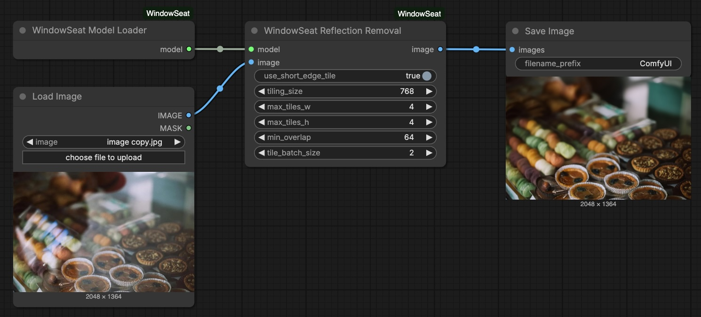

# WindowSeat Reflection Removal in ComfyUI



A ComfyUI custom node plugin for removing reflections from images using the [WindowSeat](https://github.com/huawei-bayerlab/windowseat-reflection-removal) model.

<p align="center">
  <a href="https://hf.co/spaces/huawei-bayerlab/windowseat-reflection-removal-web"></a>
  <a href="https://arxiv.org/abs/2512.05000"></a>
  <a href="https://huggingface.co/huawei-bayerlab/windowseat-reflection-removal-v1-0"></a>
  <a href="https://huggingface.co/spaces/toshas/windowseat-reflection-removal"></a>
</p>

## Installation

### Option 1: ComfyUI Manager (Recommended)

Search for "WindowSeat" in ComfyUI Manager and install.

### Option 2: Manual Installation

```bash
cd ComfyUI/custom_nodes
git clone https://github.com/toshas/ComfyUI-WindowSeat.git
cd ComfyUI-WindowSeat
pip install -r requirements.txt
```

## Usage

1. Right-click on canvas → Add Node → WindowSeat
2. Add **WindowSeat Model Loader** node
3. Add **WindowSeat Reflection Removal** node
4. Connect them: Loader → Reflection Removal
5. Add an image input (Load Image node) and connect to Reflection Removal
6. Add a Preview Image or Save Image node to see results
7. Click "Queue Prompt" to run

## Nodes

### WindowSeat Model Loader

Loads the model from HuggingFace Hub (auto-downloads on first use). Caches the model for reuse.

### WindowSeat Reflection Removal

**Required Inputs:**
- `model` - Connect from WindowSeat Model Loader
- `image` - Input image (from Load Image node)

**Optional Inputs:**

| Parameter | Default | Description |
|-----------|---------|-------------|
| use_short_edge_tile | True | Use short edge for tile size |
| tiling_size | 768 | Base tile size (512-1536) |
| max_tiles_w | 4 | Max horizontal tiles (1-8) |
| max_tiles_h | 4 | Max vertical tiles (1-8) |
| min_overlap | 64 | Tile overlap pixels (16-256) |
| tile_batch_size | 2 | Tiles per batch (1-4) |

## Requirements

- Python 3.10+
- PyTorch 2.0+
- CUDA-capable GPU
- 24GB VRAM

## Development

```bash
pip install -r requirements.txt
pre-commit install  # Required: install git hooks
```

Run tests:
```bash
./run_tests.sh           # Unit tests (no GPU)
./run_tests.sh --gpu     # All tests including GPU integration
```

## Troubleshooting

**Out of memory:**
- Reduce `tile_batch_size` to 1
- Use smaller `tiling_size` (e.g., 512)
- Process smaller images

**Model not loading:**
- Check HuggingFace Hub access
- Ensure you're logged in: `huggingface-cli login`

## Citation
Please cite our paper:

```bibtex
@misc{zakarin2025reflectionremovalefficientadaptation,
  title        = {Reflection Removal through Efficient Adaptation of Diffusion Transformers},
  author       = {Daniyar Zakarin and Thiemo Wandel and Anton Obukhov and Dengxin Dai},
  year         = {2025},
  eprint       = {2512.05000},
  archivePrefix= {arXiv},
  primaryClass = {cs.CV},
  url          = {https://arxiv.org/abs/2512.05000},
}
```

## License

The code and models of this work are licensed under the Apache License, Version 2.0.
By downloading and using the code and model you agree to the terms in [LICENSE](LICENSE.txt).